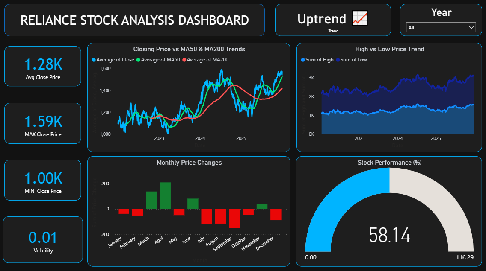

# Stock Market Analysis Dashboard – Reliance Industries

##  Project Overview
This project focuses on analyzing 3 years of Reliance Industries stock market data using Python and Power BI. The stock dataset was cleaned and preprocessed using Python, converted into CSV format, and visualized through an interactive Power BI dashboard.

The dashboard helps in understanding stock performance, price fluctuations, volatility, trading activity, and overall market trends using dynamic and interactive visualizations.

---

##  Tools & Technologies Used
- Python
- Pandas
- Power BI
- DAX
- CSV Dataset

---

##  Features
- Price Trend Analysis using line charts
- Volatility and High-Low Price Analysis
- Moving Average Visualization (MA50 & MA200)
- Profit/Loss Analysis with conditional formatting
- Gauge Chart for Overall Performance Tracking
- Interactive slicers and filters for dynamic analysis
- Trading Volume Visualization

---

##  Key Insights
- Analyzed 3 years of stock market data (~700+ records)
- Identified approximately 20% price fluctuations
- Observed overall stock growth of ~55%
- Compared moving averages to identify stock trends
- Visualized trading activity and volatility patterns

---

##  Dataset
The dataset was generated after preprocessing stock market data using Python and exporting it into CSV format for Power BI visualization.

---

## Dashboard View

  

---

